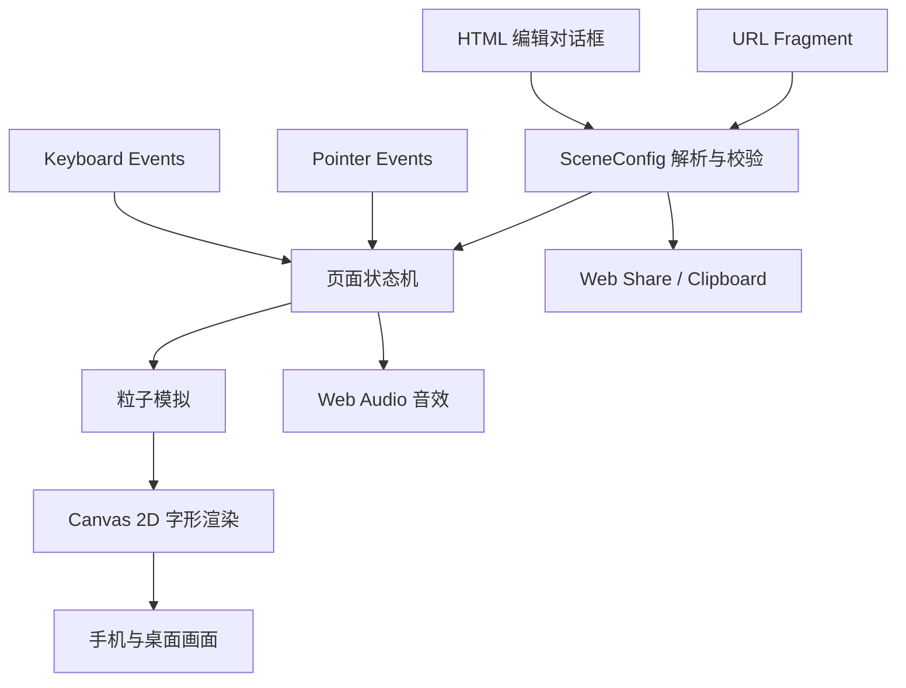
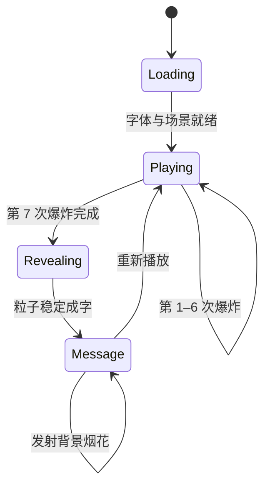

# ASCII Firework 产品与技术设计

> 状态：首版设计已确认。本文定义首版体验、技术边界和验收标准；实现应优先选择浏览器原生能力，不为尚未出现的需求预留抽象。

## 产品定义

ASCII Firework 是一个可分享的全屏网页体验。收件人通过点击、触摸或键盘亲手放烟花；第七次烟花爆炸后，空中的 ASCII 火花回流并逐渐组成发送者写下的祝福。

首版不是计分游戏，也不是动画播放器。它的核心体验是：

1. 打开链接时只看到安静的夜空和简短提示。
2. 用户自由发射七次烟花。
3. 第七次烟花爆炸后，天空短暂安静。
4. 尚未熄灭的火花汇聚成祝福文字。
5. 文字保持可读，用户仍可在背景中继续放烟花。

## 已确认的产品决策

| 主题 | 决策 | 结果 |
| --- | --- | --- |
| 产品形态 | 单页体验 | 不加入分数、关卡或账号系统 |
| 烟花表现 | Canvas 字形 | 每个可见粒子由 ASCII 字符绘制 |
| 目标设备 | 手机与桌面同等支持 | 统一使用 Pointer Events，补充键盘操作 |
| 揭示时机 | 第七次烟花 | 以第七次完成爆炸为准，不按点击次数或时间触发 |
| 成字方式 | 群星汇聚 | 现存火花减速、回流并吸附到文字采样点 |
| 分享内容 | 祝福场景 | 分享文字、配色和随机种子，不录制完整操作轨迹 |
| 声音 | 默认静音、可手动开启 | 只在用户手势后创建或恢复 AudioContext |
| 在线能力 | 无后端 | 分享状态保存在 URL Fragment 中 |

## 首版范围

### 必须实现

- 全屏响应式 Canvas。
- 鼠标、触摸、手写笔与键盘发射。
- ASCII 火箭、爆炸、重力、衰减和余烬。
- 第七次完成爆炸后触发群星汇聚。
- 祝福文字、配色和随机种子的编辑与分享。
- 默认静音的程序化音效开关。
- 降低动态效果模式和基本键盘可访问性。
- Cloudflare Workers Static Assets 部署。

### 明确不实现

- React、Vue、Svelte 或其他 UI 框架。
- 路由器、全局状态库、CSS 框架或组件库。
- 排行榜、用户账号、数据库、短链接服务或云存档。
- 完整表演录制与回放。
- 图片或视频导出。
- PWA、离线缓存与推送通知。
- WebGL、WebGPU、OffscreenCanvas、对象池或粒子 ECS。
- 埋点、第三方字体服务和第三方音频素材。

以上能力只在真实需求或性能数据出现后加入。

## 用户流程

### 创建并分享祝福

1. 创建者打开页面并进入原生 `<dialog>` 编辑面板。
2. 输入最多 8 行、不超过 200 个 Unicode 字符的祝福。
3. 从内置配色中选择一个主题。
4. 页面生成新的 32 位随机种子并预览场景。
5. 点击“分享”，优先调用 Web Share API。
6. 浏览器不支持 Web Share API 时，复制链接到剪贴板。

编辑面板只负责文字、配色和重新生成随机种子。首版不提供粒子参数、触发次数或动画曲线调节。

### 接收并体验祝福

1. 页面从 URL Fragment 读取并校验场景。
2. 初始界面不直接显示祝福内容。
3. 每次有效输入发射一枚烟花；页面记录已完成爆炸的数量。
4. 第七枚烟花完成爆炸时进入揭示阶段。
5. 揭示期间暂时忽略新的发射输入。
6. 粒子稳定成字后恢复输入，新烟花只在文字后方绘制。
7. 用户可选择重新播放，从零开始计数。

## 视觉与交互

### 视觉语言

- 背景使用接近黑色的纯色或轻微径向渐变。
- 烟花字符限定为小型字符集，例如 `* + . : | / \\ @`。
- 首版提供 4–6 个固定配色，不开放任意颜色选择器。
- 亮度主要通过颜色和透明度变化表达，不堆叠大范围模糊滤镜。
- 控件使用真实 HTML；Canvas 只负责夜空、烟花和粒子文字。
- ASCII 字符使用随项目本地发布的 WOFF2 等宽字体，避免第三方请求并稳定跨设备观感。

祝福本身不是直接绘制的普通文字。系统先把文字栅格化成目标点，再由 ASCII 粒子占据这些点，因此中文、拉丁字母和常见标点均可形成点阵轮廓。Emoji 不作为首版保证范围。

### 输入规则

- 单击或单指触摸：在输入位置发射。
- `Space` 或 `Enter`：在画面中部附近发射。
- 连续指针移动不自动连发，避免误触和粒子失控。
- 揭示阶段暂时锁定发射，文字稳定后恢复。
- 页面控件不得依赖 Canvas 命中测试。

### 揭示节奏

第七次烟花爆炸后按以下顺序执行：

1. `0–400ms`：第七次爆炸正常扩散。
2. `400–900ms`：背景烟花停止生成，现有粒子减速。
3. `900–2600ms`：粒子受到目标点吸引并汇聚成字。
4. `2600–3200ms`：粒子轻微回弹后稳定。
5. `3200ms` 以后：祝福保持，恢复背景烟花输入。

这些时长是首版体验基线，可以在实现时微调，但不暴露为用户配置。稳定时间不能依赖文字长度或配对运气，
因此实现上加了一个 **3.9s 硬截止**：到点无论粒子是否落到 0.8px 阈值内都直接吸附定形，
保证视觉与辅助技术拿到确定的完成时间（实测 3.2–3.9s）。

## 技术架构

### 技术栈

| 层次 | 技术 | 用途 |
| --- | --- | --- |
| 语言 | TypeScript 严格模式 | 场景状态、粒子模拟和输入校验 |
| 构建 | Vite | 本地开发与静态资源构建 |
| UI | 原生 HTML 与 CSS | 对话框、按钮、提示和响应式布局 |
| 渲染 | Canvas 2D | 使用 `fillText()` 绘制 ASCII 粒子 |
| 动画 | `requestAnimationFrame` | 驱动更新和渲染循环 |
| 输入 | Pointer Events、Keyboard Events | 统一手机和桌面交互 |
| 分享 | URL、Web Share、Clipboard API | 无后端场景分享 |
| 音频 | Web Audio API | 程序化升空、爆炸与余韵 |
| 部署 | Wrangler、Workers Static Assets | 发布 Vite 的 `dist` 目录 |
| 包管理 | pnpm | 安装、构建和部署脚本 |

### 运行时关系



不设置独立应用服务器。浏览器加载静态资源后，交互、生成和分享编码全部在本地完成。

### 页面状态机



状态保持为一个小型判别联合或字符串枚举，不引入通用状态机依赖。

### 建议文件结构

```text
.
├── index.html
├── src/
│   ├── main.ts          # 生命周期、输入、页面状态机和音频开关
│   ├── fireworks.ts     # 粒子更新、爆炸、揭示目标与 Canvas 渲染
│   ├── scene.ts         # SceneConfig 校验、Fragment 解析与序列化
│   └── style.css        # 全屏布局、控件和可访问性样式
├── public/
│   └── fonts/
│       └── ascii-mono.woff2
├── wrangler.jsonc
├── package.json
└── pnpm-lock.yaml
```

这三个 TypeScript 文件对应三个真实变化方向：页面流程、动画表现和持久分享格式。首版不再继续拆分 renderer、physics、audio service、repository 或 adapter。

## 数据设计

### 场景配置

```ts
interface SceneConfig {
  version: 1
  message: string
  palette: "rose" | "amber" | "aurora" | "mono"
  seed: number
}
```

- `version` 固定为 `1`，用于以后兼容已经分享的链接。
- `message` 去除首尾空白，最多 8 行和 200 个 Unicode 字符（数值与推导见 spec 04 §3.1）。
- `palette` 必须来自固定白名单。
- `seed` 必须是无符号 32 位整数。
- 缺失或无效字段回退到内置默认场景，页面不得崩溃。

随机效果使用一个很小的可播种伪随机函数，不引入随机数依赖。种子保证场景风格可复现，不保证不同设备逐帧像素完全一致。

### 分享链接

分享状态放在 Fragment，而不是查询参数：

```text
https://example.com/#v=1&m=%E4%B8%BA%E4%BD%A0%E7%9B%9B%E5%BC%80&p=rose&s=240520
```

字段含义：

| 字段 | 含义 | 校验 |
| --- | --- | --- |
| `v` | 格式版本 | 仅接受 `1` |
| `m` | URL 编码后的祝福 | 最多 8 行、200 个 Unicode 字符 |
| `p` | 配色标识 | 固定白名单 |
| `s` | 32 位随机种子 | 十进制无符号整数 |

Fragment 不会随 HTTP 请求发送给 Cloudflare，因此不会进入静态站点访问日志。但完整链接仍可能被聊天软件或收件人看到，不应把 Fragment 描述成加密或秘密存储。

解析结果只能写入 `textContent`、表单 `value` 或 Canvas，不使用 `innerHTML`。

## 动画设计

### 普通烟花

粒子使用普通对象或扁平数组保存必要字段：

```ts
interface Particle {
  x: number
  y: number
  vx: number
  vy: number
  life: number
  maxLife: number
  glyph: string
  color: string
  targetX?: number
  targetY?: number
}
```

每帧执行：

1. 将帧间隔限制在安全上限内。
2. 更新火箭和粒子的位置、速度、重力及寿命。
3. 删除寿命结束的对象。
4. 清理 Canvas 并按层绘制背景、烟花、揭示粒子和 HTML 上层控件。

首版使用可变时间步并限制过大的 `dt`。这不是精密物理模拟，不需要固定时间步、插值器或物理引擎。

### 群星汇聚

揭示文字采用浏览器原生离屏 Canvas：

1. 根据画布宽度、祝福行数和安全边距计算字号。
2. 把祝福绘制到离屏 Canvas。
3. 按固定间距读取不透明像素，得到目标点集合。
4. 使用场景随机种子打乱目标点。
5. 将现存粒子与目标点一一配对。
6. 若粒子不足，从第七次爆炸中心补充必要的余烬粒子。
7. 对每个粒子施加目标吸引、速度阻尼和轻微扰动。
8. 距离目标足够近后降低扰动，使文字保持可读。

首版不计算全局最短匹配。随机配对能够产生自然交叉轨迹，代码和计算量都更小；只有实际观感混乱时才改为按空间分区配对。

目标点数量受全局粒子上限约束。文字过长时优先缩小字号和增大采样间距，而不是突破性能预算。

### 响应式画布

- Canvas 的 CSS 尺寸跟随可视区域。
- 实际像素尺寸乘以 `devicePixelRatio`，但 DPR 上限为 `2`。
- 使用 `100dvh` 和 `env(safe-area-inset-*)` 适配移动浏览器。
- 调整尺寸时保留归一化粒子位置，避免横竖屏切换后全部消失。
- 页面不可见时暂停帧循环，恢复时丢弃过大的时间差。
- 首版设置单一全局粒子上限，初始预算为 1,200 个活动粒子。

只有在目标设备实测无法稳定运行时，才加入自动画质档位或 OffscreenCanvas。

## 声音设计

页面始终以静音状态启动，即使用户之前开启过声音也不自动播放。

用户点击声音按钮后：

1. 在该用户手势中创建或恢复 `AudioContext`。
2. 使用振荡器生成短促升空音。
3. 使用本地生成的噪声缓冲与包络生成爆炸音。
4. 使用统一主增益控制音量，并避免多个爆炸叠加削波。

首版不下载音乐或音效文件，不自动播放，也不把声音偏好写入分享链接。

## 可访问性与安全

- 所有按钮均为真实 `<button>`，具有可见焦点和可访问名称。
- 支持 `Space` 与 `Enter` 发射，不用颜色作为唯一状态提示。
- 祝福形成后才写入 `aria-live` 区域，避免辅助技术提前泄露揭示内容。
- `prefers-reduced-motion: reduce` 下减少粒子数量、取消快速闪烁，并使用较短的淡入成字替代大幅回流。
  该模式的点阵上限更小（640，文字点阵另受 512 上限约束），不足以辨认多行长祝福中文，因此稳定后同一句祝福会作为**可见 DOM 文本**覆盖层出现；
  正常模式仍只写入 `aria-live`，保持惊喜揭示。
- 触摸手势不被全局禁止：只在 Canvas 上设 `touch-action: none`，对话框与控件保留浏览器默认的滚动与双指缩放。
- 手机横屏等矮视口下，对话框有基于 `100dvh` 的最大高度并在内部滚动，控件不会落到可视区外。
- 避免高频全屏白闪；爆炸亮度和覆盖面积必须受限。
- 用户文字按 Unicode 码点限制长度，解析后仅作为文本或 Canvas 输入使用。
- 页面不收集、上传或持久化祝福内容。

## 部署

Vite 输出目录为 `dist`。纯静态首版使用 Workers Static Assets，无 Worker 脚本、`main` 入口或资源绑定：

```jsonc
{
  "$schema": "node_modules/wrangler/config-schema.json",
  "name": "ascii-firework",
  "compatibility_date": "2026-09-14",
  "assets": {
    "directory": "./dist"
  }
}
```

`compatibility_date` 采用设计确认日期；实现期间仅在需要新的 Workers 兼容行为时更新。

分享使用 Fragment，因此不需要 SPA 回退路由。所有有效分享链接都请求同一个根页面，Fragment 只由浏览器解释。

建议脚本：

```json
{
  "scripts": {
    "dev": "vite",
    "build": "tsc && vite build",
    "preview": "vite preview",
    "deploy": "pnpm build && wrangler deploy"
  }
}
```

## 验收标准

### 核心体验

- 鼠标点击、手机触摸和键盘均能成功发射烟花。
- 前六次完成爆炸不会显示祝福。
- 第七次完成爆炸稳定触发一次群星汇聚。
- 揭示时没有新的烟花打断成字过程。
- 祝福稳定后保持可读，后续烟花在其后方显示。
- 重新播放会清空粒子并把完成爆炸数重置为零。

### 分享与输入

- 包含中文、空格、换行和常见标点的祝福可以完成链接往返。
- 无效版本、配色、种子或超长文字不会导致运行时错误。
- 相同链接使用相同主题和随机种子。
- 页面源代码和初始可访问文本不直接展示祝福。
- 分享过程不向项目服务器提交内容。

### 设备与性能

- 主流手机竖屏、手机横屏和桌面浏览器布局均可操作。
- 高 DPR 设备不会创建超过 DPR 2 的 Canvas 缓冲区。
- 页面切到后台时停止动画，返回后不会出现物理跳跃。
- 1,200 个活动粒子的首版预算在目标设备上保持可接受帧率。
- 降低动态效果模式下仍能完整获知祝福。

### 声音

- 页面打开时不播放任何声音。
- 只有用户主动开启后才创建或恢复音频上下文。
- 关闭声音后，后续发射和爆炸保持静音。

## 验证方式

实现完成后至少执行：

```bash
pnpm build
pnpm preview
```

并手动检查以下最小矩阵：

| 场景 | 检查内容 |
| --- | --- |
| 手机触摸 | 发射、横竖屏、安全区和分享 |
| 桌面鼠标 | 发射、窗口缩放和剪贴板回退 |
| 键盘 | 焦点、发射、声音和重新播放 |
| 降低动态效果 | 无强闪烁、祝福仍能揭示 |
| 无效 Fragment | 安全回退默认场景 |

稳定分享格式属于首版不可回归行为。实现 `scene.ts` 时应留下一个可运行的往返检查，覆盖中文、多行文本和非法字段回退；不为其引入完整端到端测试框架。

## 未来扩展条件

| 扩展 | 何时才加入 |
| --- | --- |
| 完整表演回放 | 用户明确需要分享每次发射的位置和节奏 |
| 图片或视频导出 | 聊天平台无法良好传播互动链接 |
| Worker 与数据库 | 需要短链接、公开作品库或排行榜 |
| 自动画质调节 | 目标设备实测频繁低于可接受帧率 |
| WebGL/WebGPU | Canvas 2D 在已优化粒子预算下仍无法达标 |
| 多场景路由 | 产品出现两个以上必须独立访问的页面 |

## 参考资料

- [Vite getting started](https://vite.dev/guide/)
- [Cloudflare Workers Static Assets](https://developers.cloudflare.com/workers/static-assets/)
- [MDN Canvas API](https://developer.mozilla.org/docs/Web/API/Canvas_API)
- [MDN Pointer events](https://developer.mozilla.org/docs/Web/API/Pointer_events)
- [MDN Web Audio API](https://developer.mozilla.org/docs/Web/API/Web_Audio_API)
- [MDN Web Share API](https://developer.mozilla.org/docs/Web/API/Web_Share_API)
